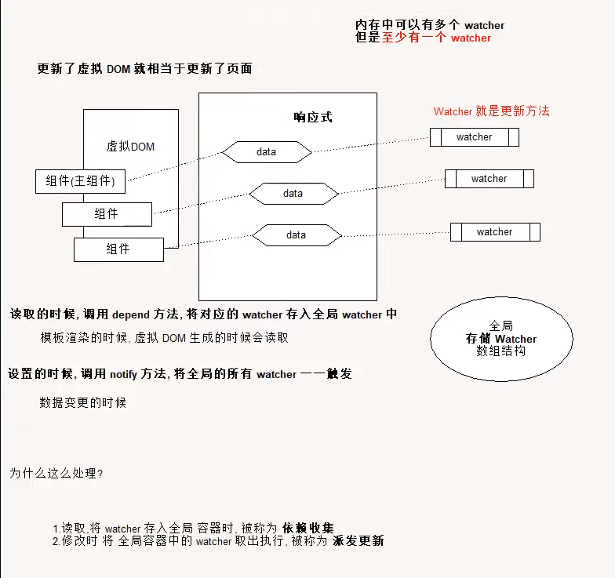

# 本线项目主要用于学习vue源码
- 工具：
    - vscode
- 插件
    - live server
1. 虚拟Dom的render方法
思考： 模板转换成抽象语法树需要执行几次！！
- 页面一开始加载需要渲染
- 每一个属性（响应式）数据在发生变化的时候 要渲染
- watch， computed等等

render的作用是将虚拟Dom转换为真正的Dom加载到页面
- 一个项目运行的时候，模板是不会变的，就表示AST是不会变的

我们可以将代码进行优化，将虚拟DOM缓存起来，生成一个函数，函数 只需要传入数据就可以得到真正的DOM

# 事件模型发布订阅者模式

# Vue源码解读
1. 各个文件夹的作用
2. Vue初始化流程

## 各个文件夹的作用
1. compiler 的作用
    - vue使用**字符串**作为模板
    - 在编译文件中存放对模板字符串的解析算法，抽象语法树，优化等
2. core核心 vue构造函数，生命周期等方法的部分
3. platforms 平台
    - 针对运行的环境（设备）有不同的实现
    - vue的入口
4. server 服务端，主要将vue用在服务端的处理代码（暂时没看）
5. sfc 单文件组件（暂时没看，用在vue-cli）
6.shared 公共工具，方法